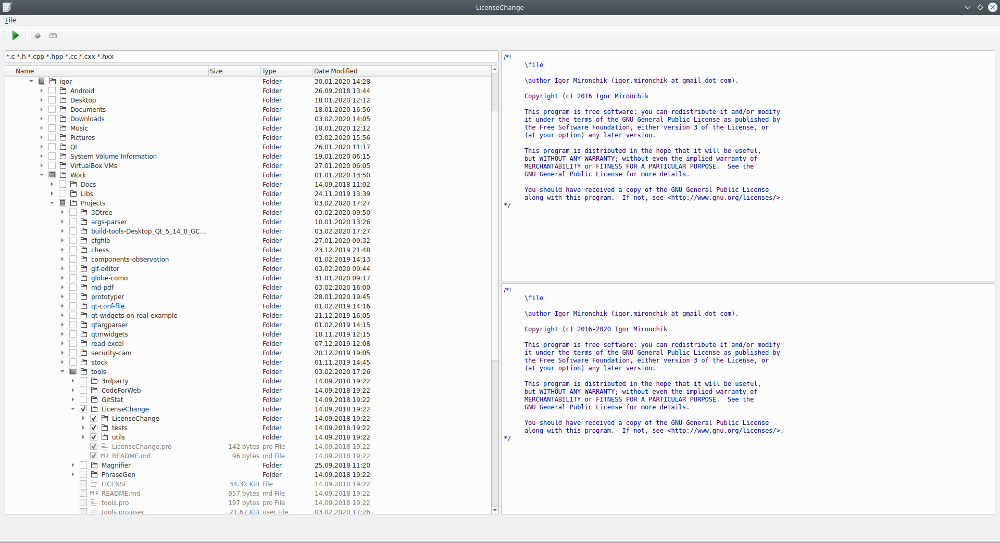

# About

Tools is a project for different useful to developers tools.

## CodeForWeb

CodeForWeb is a GUI application that prepare text to pasting to HTML. Just paste 
your code, select and copy. And in the clipboard code will be prepared for HTML.

## GitStat

GitStat is console app to calculate stat in the Git repo.

```txt
GitStat -a "Igor Mironchik" -a igor.mironchik@gmail.com
...
Sun Nov 13 2012 added 992 deleted 92
Fri Nov 4 2012 added 729 deleted 50
Fri Nov 2 2012 added 2645 deleted 0
----------
Total:
----------
Added 91390 line(s)
Deleted 48927 line(s)
97 day(s)
```

## LicenseChange

LicenseChange is a GUI application that find license in text files and changes it to the
new one.
            


# Getting from Repository

After clone update submodules with the next command:

```
git submodule update --init --recursive
```
